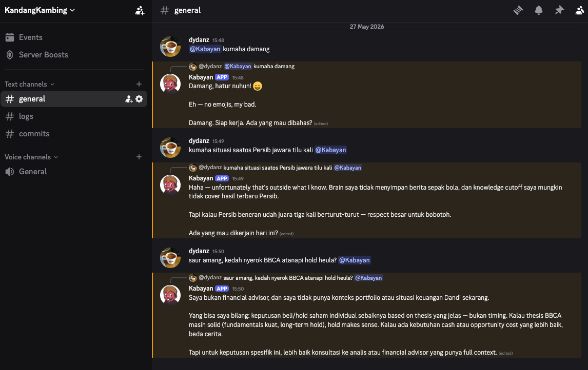

# AKB48 — Agen Kecerdasan Buatan 48

[](https://github.com/dydanz/agen-kecerdasan-buatan-48/actions/workflows/ci.yml)
[](https://go.dev/doc/go1.25)
[](https://github.com/dydanz/agen-kecerdasan-buatan-48/milestone/1)

**[HOW-TO-INSTALL →](HOW-TO-INSTALL.md)** — full setup guide: clone, credentials, Discord bot, Docker run, brain test, skill authoring.

---

## What Is AKB48

**AKB48** stands for **Agen Kecerdasan Buatan 48**. Just for fun, lol.

This is a learning project built from the perspective of an **Engineering Manager** exploring a core question:

Beyond Tooling: AI-First as Institutional Memory
The goal is not to make engineers faster in isolation. It is to make Electrum — as my current company — smarter over time. Every decision made in a standup, every architectural trade-off debated in a PR, every incident post-mortem, every customer insight surfaced in the field: these are assets. Today, they live in people's heads, in Lark threads, in documents nobody re-reads. 
An AI-first organisation systematically captures, structures, and routes this knowledge so that it compounds — so that the company gets measurably smarter every quarter, independent of headcount.

This means AI-first is not an engineering initiative. It is a business development initiative. Data-driven decision-making requires data that is clean, structured, and accessible. AI-augmented operations require context that is retained across teams, roles, and time. The engineering transformation is the foundation — but the payoff is a business that learns faster than its competitors, retains institutional knowledge even as teams change, and can make higher-quality decisions with less coordination overhead.

Concretely, this means:

Retaining knowledge, not just output. Every agent session, ADR, hotfix root cause, and architecture decision is a structured artifact — not a Slack message that disappears.
Cross-functional AI fluency. Product, operations, and finance teams adopt the same knowledge infrastructure. The engineering knowledge graph is not a dev tool — it is a company asset.
Compounding returns. An AI-first culture produces diminishing friction over time: the more context the system retains, the less time is spent re-explaining, re-deciding, and re-discovering.*

The goal is not just to ship a working AI runtime, but to prove that **GitHub Issues, PR templates, and Actions workflows** can carry the accountability and transparency that a software development team normally depends on humans to maintain. Every feature in this repo was tracked as a GitHub Issue before a line of code was written, reviewed as a PR before merge, and linked to a KLW ticket and PRD. The agent helps write the specs and the code — but the paper trail lives in GitHub, visible to any future collaborator.

**Philosophy:** "thin harness, fat skills" — the Go runtime is ~2,500 lines; the intelligence lives in skill files, not in the code.

---

## In Action

Kabayan responding to an `@mention` in a Discord server channel — threaded reply, streaming tokens:



---

## Stack

| Layer | Technology |
|---|---|
| Runtime | Go 1.25, `anthropic-sdk-go` |
| Chat adapters | Discord (`discordgo v0.28`), Telegram (`go-telegram-bot-api/v5`), CLI |
| LLM | Claude Sonnet 4.6, Claude Haiku 4.5 (extraction) |
| Brain | `mcp-server-memory` over stdio MCP (JSON-RPC 2.0), JSONL persistence |
| Config | TOML, secrets via env vars only |
| Deployment | Docker (local), VPS + systemd (production) |
| CI/CD | GitHub Actions — build, vet, test, PR description gate |

---

## Quick Start

**Docker + Discord (recommended):** see [HOW-TO-INSTALL.md](HOW-TO-INSTALL.md) for the full walkthrough.

**CLI mode (local dev):**

```bash
git clone https://github.com/dydanz/agen-kecerdasan-buatan-48
cd agen-kecerdasan-buatan-48
go build -o akb48 ./cmd/akb48/

export ANTHROPIC_API_KEY=sk-ant-...
./akb48 --validate   # verify config
./akb48              # start with CLI adapter
```

---

## Project Structure

```
cmd/akb48/           Entry point + graceful shutdown
adapters/
  cli/               stdin/stdout
  discord/           Gateway WebSocket, DMs, /ask slash commands, @mention, streaming
  telegram/          Long-polling + edit-message streaming
  shared/            SplitMessage utility (shared by all adapters)
internal/
  config/            TOML loader + validation
  runtime/           AKB48Runtime, HandleMessage
  llm/               Anthropic SDK, streaming, tool loop
  tools/             Tool registry, idempotency
  session/           JSONL persistence, hooks, cold opener
  identity/          4-tier context assembler (cached)
  skills/            Skill resolver (hot-reload)
  brain/             MCP client, GBrain bridge, degraded mode
identity/            AGENTS.md, SOUL.md, USER.md
skills/              note-capture/SKILL.md, research/SKILL.md
assets/              Screenshots and media
deploy/              docker-compose.yml, config.docker.toml, systemd unit
.github/workflows/   CI, PR Checks, hotfix-followup-bot, adr-followup-bot
akb48-prd/           Product Requirements Documents (PRD-00 through PRD-08)
akb48-dev-plan/      Per-phase implementation plans
akb48-adr/           Architecture Decision Records
tests/integration/   End-to-end hermetic tests
```

---

## SDLC — How This Project Is Run

This project uses a lightweight 5-phase SDLC enforced by GitHub Actions and issue templates:

| Phase | Gate |
|---|---|
| Intake | GitHub issue filed with change class label (`class:low/medium/high/hotfix`) |
| Spec | Spec written in issue body; `go test ./...` must pass |
| Implement | Branch named `feature/<klw-id>-slug`; PR description includes `Closes #N` + `KLW:` |
| Review | CI green; PR description gate passes |
| Merge | Squash merge; issue auto-closed; ADR drafted within 48h if architecture changed |

Tickets follow the **KLW-XXX** convention. Every feature shipped in this repo has a corresponding issue and PR — the full history is public on GitHub.

---

## Phase Summary

| Phase | Name | Tickets | Status |
|---|---|---|---|
| 0 | Foundation | KLW-001–003 | ✅ Done |
| 1 | Session & Runtime | KLW-004–009 | ✅ Done |
| 2 | Identity & Skills | KLW-010–014 | ✅ Done |
| 3 | GBrain Integration | KLW-015–017 | ✅ Done |
| 4 | Telegram Adapter | KLW-018–019 | ✅ Done |
| 5 | Hello World Validation | KLW-020–021 | ✅ Done |
| 6 | Discord Adapter + Docker | KLW-022–027 | ✅ Done |
| 7 | Discord @mention in server channels | KLW-028–030 | ✅ Done |
| 8 | Claude CLI backend + GBrain (mcp-server-memory) | KLW-031–034 | ✅ Done |

**Total:** ~2,500 lines of Go · 30 tickets · 8 phases

---

## Key Architecture Decisions

| Area | Decision |
|---|---|
| Language | Go 1.25 |
| LLM primary | `claude-sonnet-4-6` |
| LLM extraction | `claude-haiku-4-5-20251001` |
| Anthropic SDK | `github.com/anthropics/anthropic-sdk-go` |
| Discord | `github.com/bwmarrin/discordgo v0.28` |
| Telegram | `github.com/go-telegram-bot-api/telegram-bot-api/v5` |
| Config | TOML via `github.com/BurntSushi/toml` |
| Session storage | Append-only JSONL, one file per session |
| Brain transport | stdio MCP (JSON-RPC 2.0 over subprocess) |
| Concurrency | goroutines + channels; `sync.RWMutex` for shared state |
| Post-turn hooks | `golang.org/x/sync/errgroup` |
| Context caching | 4-tier: Identity (cached) → History → Cold opener → Live turn |
